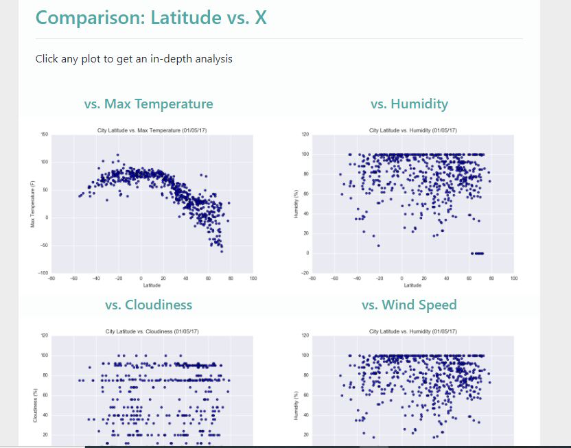

# web_design_challenge

## Background

Take HTML and CSS to create a dashboard showing off the analysis we've done.

## Project details

### Latitude - Latitude Analysis Dashboard website

Create a visualization dashboard website using visualizations made before and data (Resources/cities.csv).

### Website is included the follows:

The website consists of 7 pages total, including:

* A [Home page](#landing-page) containing:

    
  * An explanation of the project.
  * There is a sidebar containing preview images of each plot.  

* A ["Comparisons" page](#comparisons-page) that:
    
  * Contains all of the visualizations on the same page so we can easily visually compare them.
  * And clicking any image will take the user to that visualization.
  * Uses a Bootstrap grid for the visualizations.
  
* A ["Data" page](#data-page):
    

* Four [Visualization pages](#visualization-pages), each with:
    
  * A descriptive title and heading tag.
  * The plot/visualization itself for the selected comparison.
  * A paragraph describing the plot and its significance.
  
## Job done!